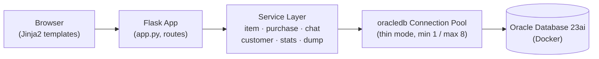
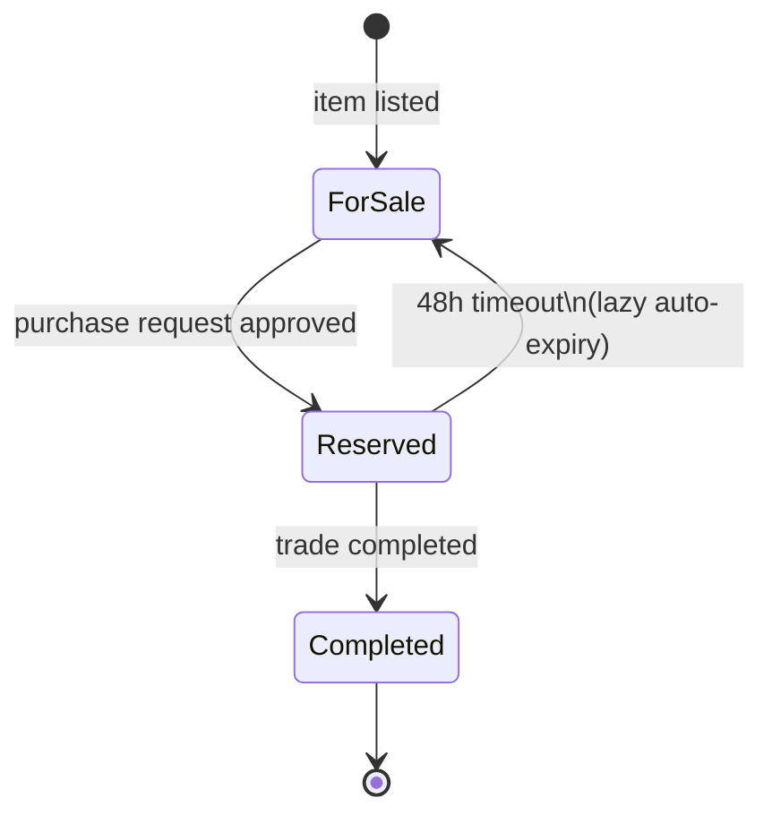
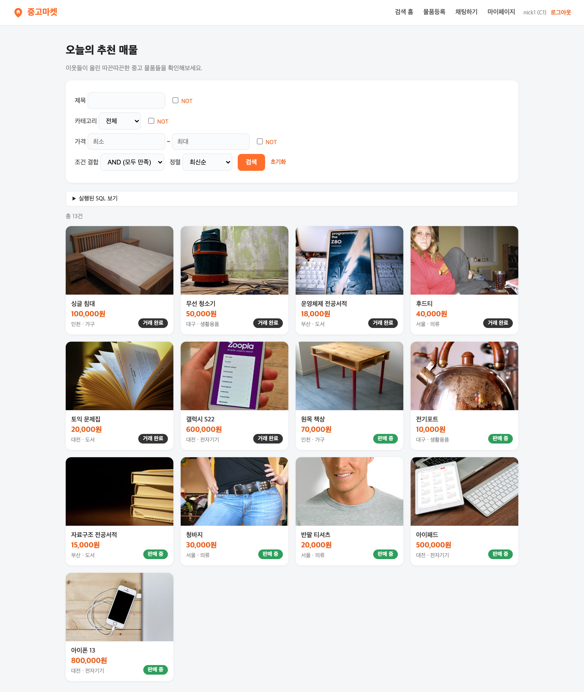
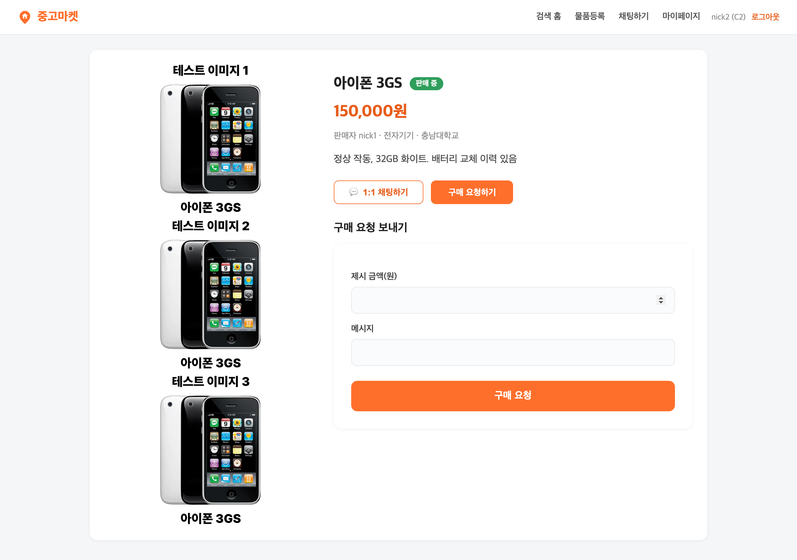
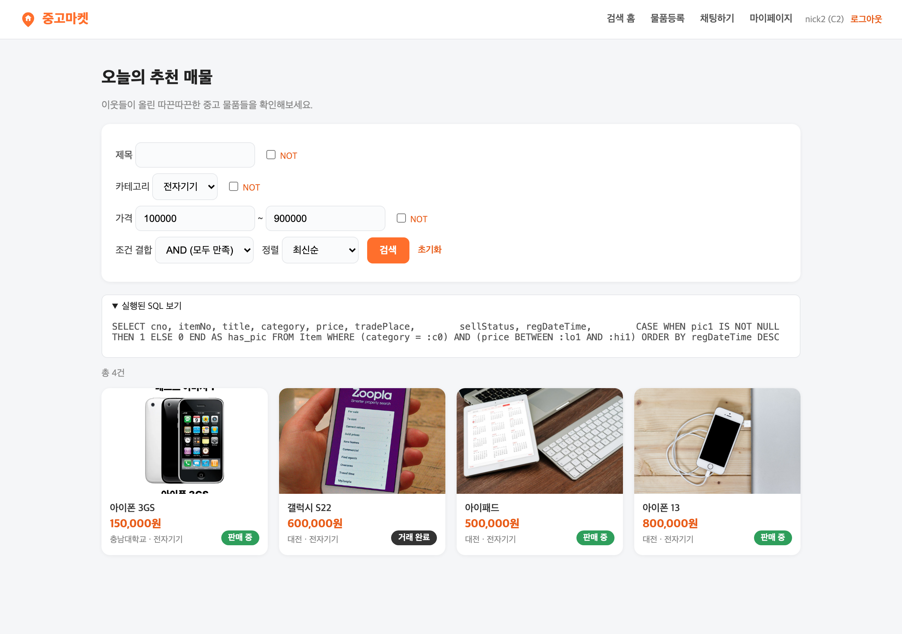
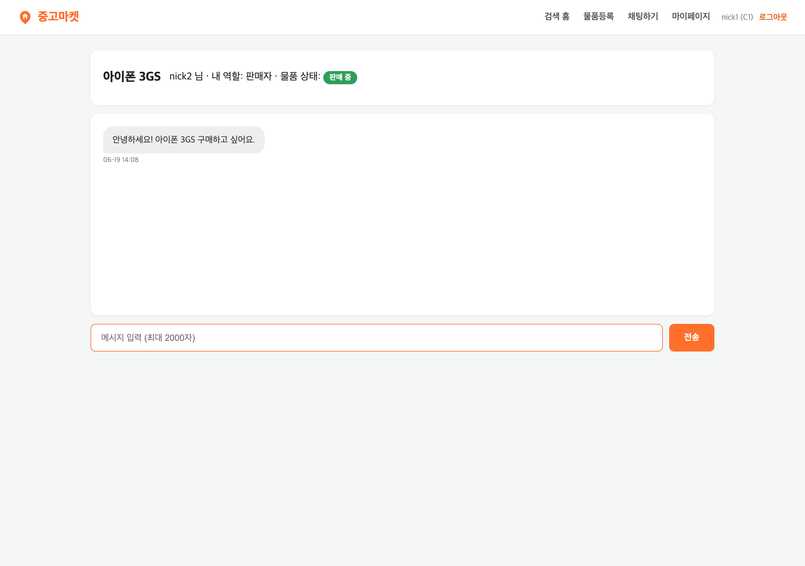
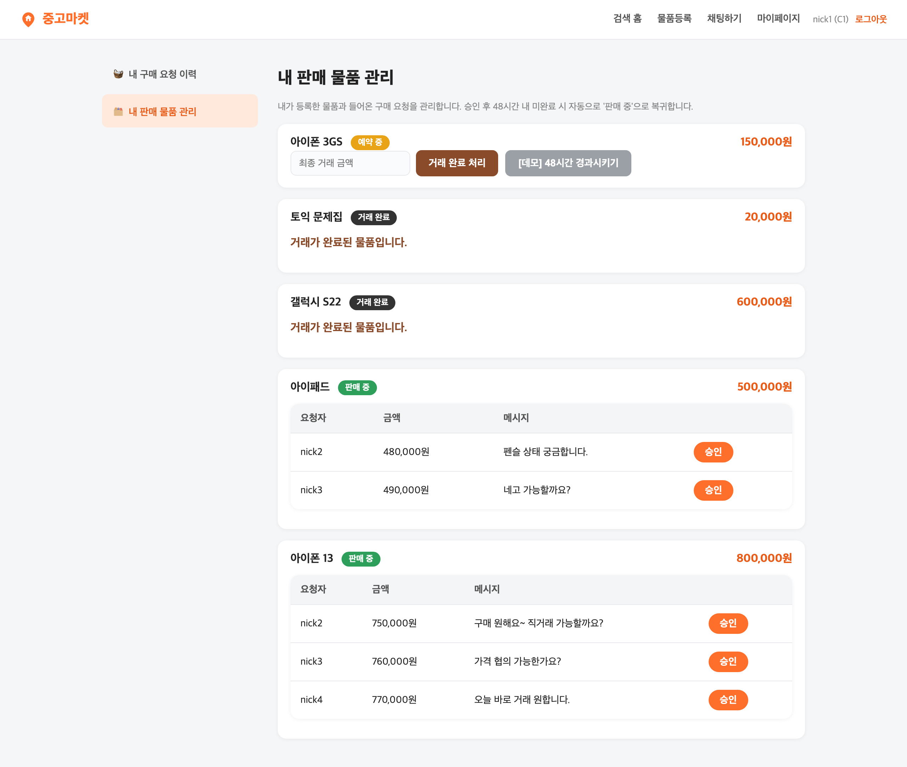
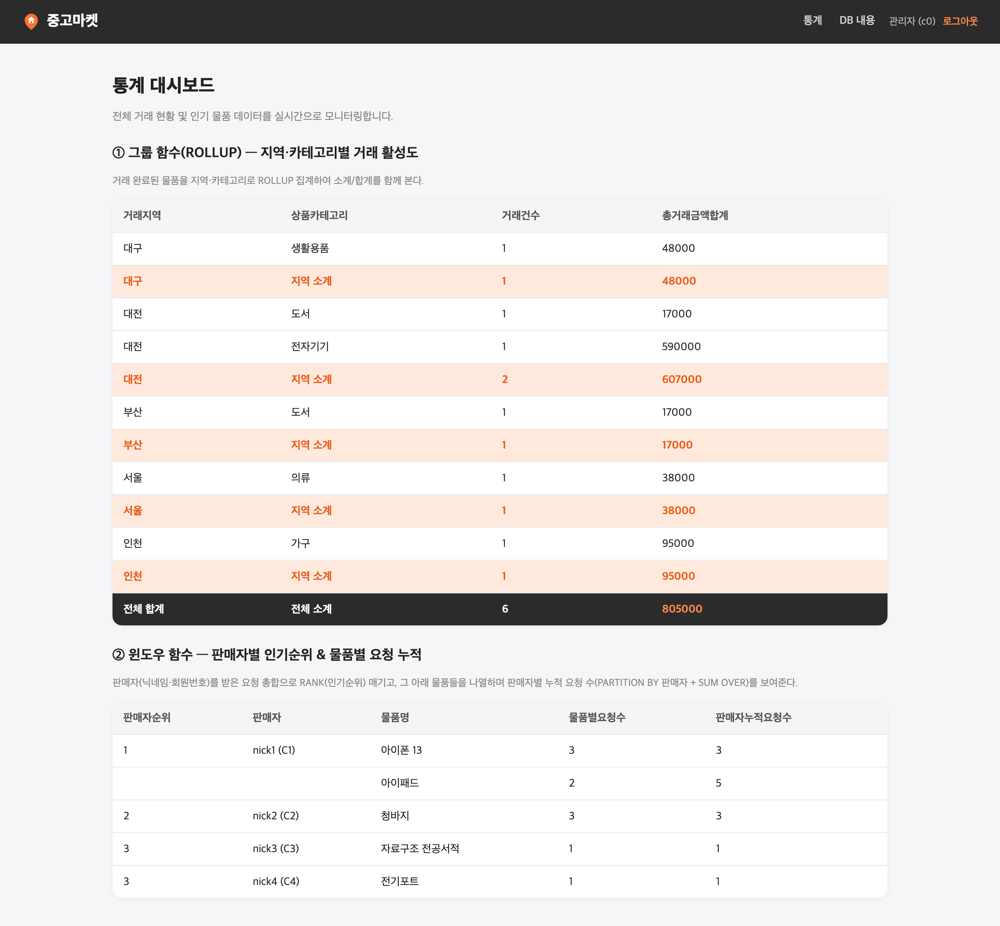

# Used Market — Oracle-Based Marketplace Platform


[](https://github.com/leeyunseokarchive/Oracle-Based-Used-Market/actions/workflows/ci.yml)

A full-stack online marketplace built on **Flask + Oracle Database 23ai**, covering the entire trade lifecycle — search, listing, purchase requests, 1:1 chat, and transactional approve/complete flows — with admin statistics.

---

## Highlights

- **Transaction-safe state machine** — every trade step (request → approve → reserve → complete) runs inside a DB transaction, so partial updates never leave the data inconsistent
- **Dynamic SQL search engine** — keyword search supports AND/OR/NOT combinations plus price/date sorting, built by composing SQL conditions at request time
- **Lazy auto-expiry** — reservations older than 48h are recovered back to "for sale" on the next relevant read, with no background scheduler required
- **Service-layer architecture** — 6 independent service modules (item, purchase, chat, customer, stats, dump) sit over a pooled `python-oracledb` connection layer
- **One-command reproduction** — `docker compose up -d` + a schema/seed script gets a fully working Oracle instance from zero

## Features

| Feature | Description |
|---|---|
| Auth & roles | Member vs. admin permission split, session-based authentication |
| Item listing | Up to 3 photos per listing, category tagging, input validation |
| Conditional search | Keyword AND/OR/NOT search + price/date sorting (dynamically generated SQL) |
| Purchase requests | Multiple buyers can request the same item concurrently |
| 1:1 chat | Per-listing seller/buyer chat rooms with unread-message badges |
| Approve → complete | Request approval → "reserved" → "completed" state transitions, all transaction-guaranteed |
| Auto-expiry | Reservations past a 48h timeout are lazily reverted to "for sale" — no scheduler needed |
| Admin stats | Sales/trade statistics by category (GROUP BY aggregation) |

## Architecture



## Item state machine



## Screenshots

| Search home | Item detail (3 photos) |
|---|---|
|  |  |

| AND/OR/NOT combined search | 1:1 chat (read receipts) |
|---|---|
|  |  |

| Approve → reserved | Admin statistics |
|---|---|
|  |  |

> Detailed design notes (schema, per-module algorithms, request-processing flow) are in [REPORT.md](./REPORT.md) *(Korean, written for the original course submission)*.

---

## Getting Started

> Prerequisites: Docker (or colima), Python 3.8+

### 1. Start the Oracle server

Spins up an Oracle 23ai Free container via `docker-compose.yml`.

```bash
docker compose up -d
```

- Connection: `localhost:1521`, service name `FREEPDB1`
- App account: `tpuser` / `tppw`
- First boot takes 1-2 minutes for DB initialization. Wait for `healthy`:

```bash
docker compose ps          # wait until STATUS shows healthy
```

Stop the container with `docker compose down`, or `docker compose down -v` to also wipe the data.

### 2. Create a virtualenv and install dependencies

```bash
python3 -m venv .venv
.venv/bin/python -m pip install -r requirements.txt
```

### 3. Load schema + seed data

```bash
.venv/bin/python init_db.py
```

### 4. Run the app

```bash
.venv/bin/python app.py
```

Open **http://127.0.0.1:5001** in your browser.

> macOS binds port 5000 to the AirPlay receiver by default, so this app defaults to 5001.
> To use a different port: `TP_PORT=8000 .venv/bin/python app.py`

---

## Test accounts

| Role | Member ID | Password |
|---|---|---|
| Member | `C1` – `C5` | `pw1` – `pw5` |
| Admin | `c0` | `admin` |

## Project structure

```
.
├── app.py                # Flask entrypoint & routes
├── config.py              # DB connection + app constants (env-overridable)
├── db.py                  # oracledb connection pool + transaction helpers
├── init_db.py              # schema + seed loader
├── services/               # business logic, one module per domain
│   ├── item_service.py     #   listing, search, state transitions, expiry
│   ├── purchase_service.py #   purchase requests
│   ├── chat_service.py     #   1:1 chat rooms & messages
│   ├── customer_service.py #   auth & roles
│   ├── stats_service.py    #   admin statistics
│   └── dump_service.py     #   raw table dump (admin)
├── schema/                 # DDL + seed SQL
├── templates/               # Jinja2 views
├── static/                  # CSS + seed images
└── docs/                    # UI screenshots
```

## License

MIT — see [LICENSE](./LICENSE).
