# [TP-7] 최종 보고서 — 온라인 중고거래 플랫폼

> **학과:** 인공지능학과  **학번:** 202202494  **이름:** 이윤석  **제출일:** 2026-06-__
>
> 제출 파일명: `학번_TP-7.zip` (예: `202202494_TP-7.zip`) — 본 보고서 + `tp_demo/` 소스코드.
> 본 문서의 화면 캡처는 `eval/capture_screens.py`로 앱을 구동해 자동 수집한 `docs/*.png`를 그대로 삽입한 것이다. 한글(hwp)/워드 양식으로 옮길 때는 같은 이미지를 끼워 넣으면 된다.

---

## 목차
- [7-1. 구축된 DB의 각 테이블 내용 출력 (20점)](#7-1-구축된-db의-각-테이블-내용-출력-20점)
- [7-2. 구현된 시스템 상세 설명 (40점)](#7-2-구현된-시스템-상세-설명-40점)
- [7-3. User Manual (100점)](#7-3-user-manual-100점)
- [7-4. 소스 코드 설명 (50점)](#7-4-소스-코드-설명-50점)
- [부록. 제출 절차 체크리스트](#부록-제출-절차-체크리스트)

---

## 7-1. 구축된 DB의 각 테이블 내용 출력 (20점)

데모 DB는 5개 테이블(`Customer`, `Item`, `PurchaseReq`, `ChatRoom`, `Message`)로 구성된다. 관리자(`c0`) 로그인 후 **[DB 내용]** 메뉴(`/admin/db-dump`)에서 전체 테이블의 실제 적재 행을 한 화면에 출력한다. BLOB 이미지 컬럼 `pic1~3`은 화면 부담을 줄이기 위해 `<BLOB n바이트>` 형태로 길이만 표시한다(`services/dump_service.py`).

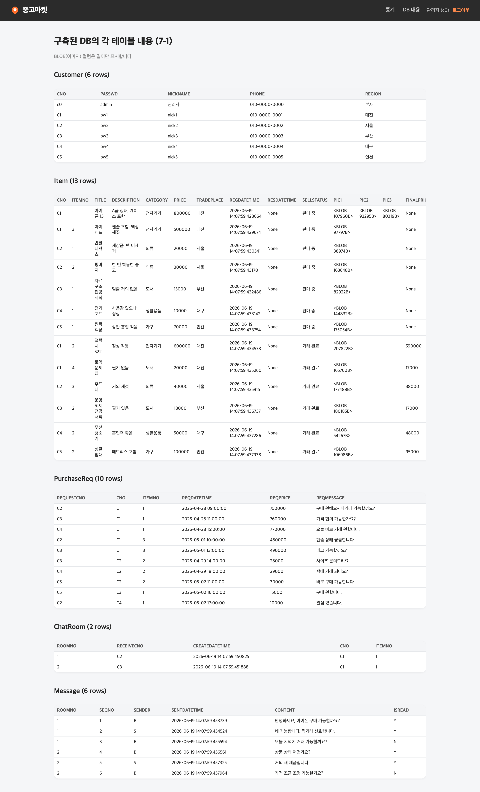

*▲ 관리자 [DB 내용] 화면 — 5개 테이블이 순서대로 출력된다.*

### 적재 데이터 요약 (`schema/02_seed.sql` 기준)

| 테이블 | 행 수 | 내용 요약 |
|---|---|---|
| **Customer** | 6 | 관리자 `c0` 1명 + 일반 회원 `C1`~`C5`. 지역(대전·서울·부산·대구·인천)을 분산해 통계 그룹 기준으로 사용. |
| **Item** | 13 | 판매 중 7개 + 거래 완료 6개. 5개 카테고리(전자기기·의류·도서·생활용품·가구). **모든 물품에 물품별 실제 사진(BLOB)** 보유(아이폰 13은 3장). |
| **PurchaseReq** | 10 | 한 물품에 여러 요청이 몰린 형태(아이폰 3건). 요청일자를 4/28~5/2로 분산해 윈도우 함수 통계용. |
| **ChatRoom** | 2 | 물품당 (구매자·판매자) 1방. `roomNo`는 IDENTITY 자동 채번. |
| **Message** | 6 | 방마다 3건. 마지막 메시지는 `isRead='N'`으로 두어 안 읽음 배지·읽음 전환을 시연. |

> 행 수는 `init_db.py` 실행 시 콘솔에도 함께 출력된다(`Customer 6 rows … 이미지 주입 완료: 15장`).

### 각 테이블의 의미 (스키마 ↔ 데이터)
- **Customer**: 회원번호(PK)·비밀번호·닉네임(UNIQUE)·전화·지역. 지역은 통계의 그룹 기준이 된다.
- **Item**: 판매자별 `itemNo`를 1,2,3…으로 부여(복합 PK `cno+itemNo`). `sellStatus`는 `판매 중/예약 중/거래 완료` 3상태(CHECK 제약). `regDateTime`(등록)·`resDateTime`(예약, 48h 타이머)·`finalPrice`(최종가) 보유.
- **PurchaseReq**: (요청자·판매자·물품) 복합 PK라 **같은 사람이 같은 물품에 중복 요청 불가**. 제시 금액·메시지 저장.
- **ChatRoom**: (구매자·판매자·물품) UNIQUE 제약으로 **물품당 1:1 방 1개** 보장.
- **Message**: 방별 `seqNo` IDENTITY, `sender`(S=판매자/B=구매자), `isRead`(Y/N).

---

## 7-2. 구현된 시스템 상세 설명 (40점)

### (1) 구현 환경

| 구분 | 내용 |
|---|---|
| DBMS | **Oracle Database 23ai Free** (Docker 이미지 `gvenzl/oracle-free:23-slim`, Apple Silicon/arm64 네이티브) |
| 언어/런타임 | **Python 3.8+** |
| 웹 프레임워크 | **Flask 3.x** (서버사이드 렌더링) |
| DB 드라이버 | **python-oracledb** — *thin 모드*라 Oracle Instant Client 설치 불필요 |
| 템플릿/뷰 | **Jinja2** SSR + 단일 `static/style.css` |
| 접속 정보 | `localhost:1521 / FREEPDB1`, 앱 계정 `tpuser`/`tppw` (`config.py`, 환경변수로 override 가능) |

**아키텍처(3계층 분리).** 요청은 `app.py`의 라우트 → `services/*`의 도메인 로직(SQL) → `db.py` 커넥션 풀 → Oracle 순으로 흐른다. 모든 SQL은 서비스 계층에만 두고, `db.get_conn()` 컨텍스트 매니저가 정상 종료 시 `commit`, 예외 시 `rollback`을 일괄 처리해 **트랜잭션 경계를 한곳에서** 관리한다.

```
브라우저 ─HTTP→ app.py  (표현 계층: 라우트·세션·검증·예외)
                   │  함수 호출
                   ▼
        services/*  (도메인 서비스 계층: customer · item · purchase · chat · stats · dump)
                   │  SQL + 바인드 변수
                   ▼
        db.py  get_conn()  (데이터 접근 계층: 커넥션 풀 min1/max8, commit/rollback)
                   │
                   ▼
        Oracle 23ai Free (FREEPDB1)
```

### (2) 각 모듈별 주요 알고리즘

**모듈의 기준.** 본 시스템에서 "모듈"은 *단일 책임을 갖도록 분리한 소스 파일*을 가리키며, 위 3계층의 구성 단위와 일치한다. 즉 표현 계층의 `app.py`, 데이터 접근 계층의 `db.py`, 그리고 도메인 서비스 계층의 `services/` 6개 파일이 각각 하나의 모듈이다. 아래 표는 **모듈 ↔ 책임 ↔ 주요 알고리즘**의 1:1 매핑이며, 이어서 모듈별로 핵심 알고리즘을 설명한다.

| 모듈(파일) | 계층 | 주요 알고리즘 / 책임 |
|---|---|---|
| `customer_service.py` | 서비스 | 회원 인증(바인드 변수 자격 조회) |
| `item_service.py` | 서비스 | 조건 검색(AND/OR/NOT 동적 조립), 48h lazy 만료, itemNo 채번, FK 역순 삭제 |
| `purchase_service.py` | 서비스 | 구매 요청 생성/조회, **승인 단일 트랜잭션**(예약 전환+타요청 삭제+채팅방 보장) |
| `chat_service.py` | 서비스 | 채팅방 멱등 보장(UNIQUE+RETURNING), 역할 판정, 안 읽음 집계·읽음 처리 |
| `stats_service.py` | 서비스 | 그룹 함수(ROLLUP+GROUPING), 윈도우 함수(RANK+SUM OVER+ROW_NUMBER) |
| `dump_service.py` | 서비스 | 전체 테이블 덤프(BLOB은 길이만 표시) |
| `app.py` | 표현 | URL 라우팅, 세션·권한 데코레이터, 폼 1차 검증, 예외 핸들러 |
| `db.py` | 데이터 접근 | 커넥션 풀, `get_conn()` 트랜잭션 컨텍스트(commit/rollback 일원화) |

#### ① `item_service.py` — 조건 검색(AND/OR/NOT)·48h 만료 등
- **조건 검색(`search`)**: 사용자가 고른 제목·카테고리·가격 조건을 각각 술어(predicate)로 만들고, 선택한 연산자(`AND`/`OR`)로 결합한다. 개별 조건의 NOT은 술어 앞에 `NOT`을 붙인다. **값은 전부 바인드 변수(`:t0`, `:lo1` …)로만 전달**하므로 SQL 인젝션에 안전하다. 가격은 입력 조합에 따라 `BETWEEN`/`>=`/`<=`로 분기한다. 완성된 SQL 문자열을 화면 하단 "실행된 SQL 보기"로 그대로 노출해 동작 근거를 보인다.
- **48시간 자동 취소(`expire_reservations`)**: 별도 스케줄러 없이 화면 조회 직전마다 호출하는 *lazy* 방식. `SYSTIMESTAMP - resDateTime > NUMTODSINTERVAL(48,'HOUR')`인 '예약 중' 물품에 대해 ① 남은 구매 요청을 삭제하고 ② 상태를 '판매 중'으로 되돌리며 `resDateTime`을 비운다(한 트랜잭션). 데모는 `force_expire`로 `resDateTime`을 49시간 전으로 돌려 즉시 시연한다.
- **등록(`register_item`)**: `SELECT NVL(MAX(itemNo),0)+1`로 판매자별 물품번호를 채번하고, 이미지(최대 3장)를 `pic1~3` BLOB에 매핑한다.
- **삭제(`delete_item`)**: FK 제약 때문에 `Message → ChatRoom → PurchaseReq → Item` 자식부터 역순으로 지운다(한 트랜잭션).

#### ② `purchase_service.py` — 구매 요청 승인(단일 트랜잭션)
`approve_request`는 하나의 트랜잭션 안에서 (1) 물품을 '예약 중'으로 전환하고 `resDateTime`을 찍어 48h 타이머를 시작, (2) **승인되지 않은 다른 요청을 모두 삭제**, (3) 승인 구매자–판매자 채팅방을 보장(있으면 재사용)한다. (1)에서 `rowcount != 1`이면(이미 예약/판매완료) `ValueError`로 중단되고 컨텍스트가 전체를 롤백한다.

#### ③ `chat_service.py` — 중복 방 방지·읽음 처리
`UQ_ChatRoom(receiveCno, cno, itemNo)` 제약을 활용해 물품당 (구매자,판매자) 방을 1개로 보장한다(`_ensure_room_cur`: 있으면 그 `roomNo`, 없으면 INSERT 후 `RETURNING`으로 새 번호 회수 — 멱등). 방 목록(`list_rooms`)은 "상대가 보냈고 `isRead='N'`"인 메시지를 세어 **안 읽음 수 배지**를 만들고, 방 입장 시 `mark_read`로 상대 메시지를 일괄 읽음 처리한다. 한 회원이 방마다 판매자(S)/구매자(B) 역할이 달라질 수 있어 `_role_in_room`으로 역할을 판정한다.

#### ④ `stats_service.py` — 그룹/윈도우 함수
- **그룹 함수(ROLLUP)**: `GROUP BY ROLLUP(region, category)`로 지역·카테고리별 거래 완료 건수와 **총 거래 금액 합계**를 구하고, `GROUPING()`으로 소계/총계 행에 라벨을 붙인다.
- **윈도우 함수**: `RANK() OVER (ORDER BY SUM(req_cnt) DESC)`로 받은 요청 총합 기준 **인기 판매자 순위**를, `SUM() OVER (PARTITION BY 판매자 ORDER BY …)`로 판매자별 **누적 요청 수**를 계산한다. `ROW_NUMBER()`로 판매자 머리행에만 순위·이름을 표시한다.

#### ⑤ `customer_service.py` / `dump_service.py`
- `customer_service.login`: 회원번호+비밀번호를 바인드 변수로 조회해 일치 시 회원 dict, 불일치 시 `None`을 반환한다.
- `dump_service.dump_all`: 5개 테이블을 순회하며 전체 행을 반환하되, BLOB 컬럼은 `<BLOB n바이트>`로 길이만 표시한다(7-1 화면).

#### ⑥ `app.py` / `db.py` — 표현·데이터 접근 계층
- `app.py`: URL↔화면 매핑, 로그인/관리자 데코레이터(`login_required`, `admin_required`), 폼 1차 검증, 세션 관리, 그리고 403/404/500을 트레이스백 대신 안내 페이지(`templates/error.html`)로 응답하는 예외 핸들러. 데모는 `TP_DEBUG=0`(기본)으로 띄워 이 핸들러가 항상 동작한다.
- `db.py`: 커넥션 풀(min1/max8)과 `get_conn()` 컨텍스트 매니저로 정상 시 `commit`, 예외 시 `rollback`을 일원화한다.

---

## 7-3. User Manual (100점)

각 기능을 **[사전 화면] → [조작] → [사후 화면]** 순서로 설명한다. 아래 순서는 `eval/process.md`의 데모 시나리오와 1:1로 대응하며, 화면은 모두 실제 구동 캡처다. 기능 2에서 판매자 `C1`이 등록하는 **'아이폰 3GS'** 물품을 중심으로 검색→구매요청→채팅→승인→완료까지 하나의 흐름으로 이어진다.
시작 전 준비: `docker start tp_oracle` → `python init_db.py`(초기화) → `TP_DEBUG=0 python app.py` → http://127.0.0.1:5000

**테스트 계정**

| 역할 | 회원번호 | 비밀번호 |
|---|---|---|
| 판매자 A | `C1` | `pw1` |
| 구매자 B | `C2` | `pw2` |
| 구매자 C | `C3` | `pw3` |
| 관리자 | `c0` | `admin` |

### 기능 1. 로그인 & 권한 구분 (`/`)
- **[사전 화면]** 로그인 폼(상단 메뉴바 없음).

  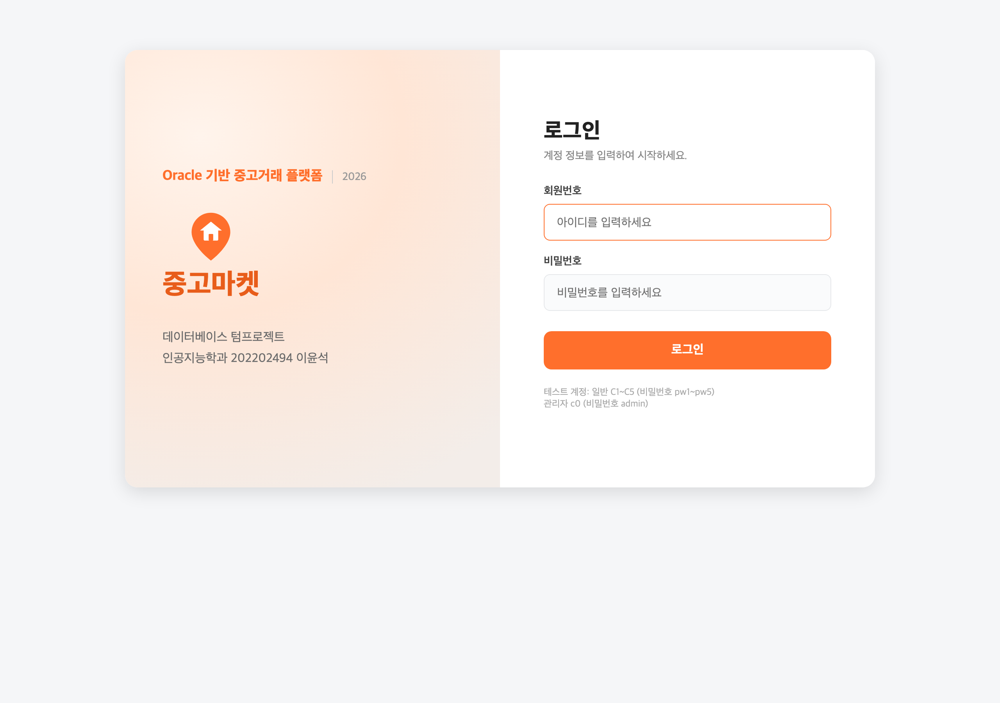

- **[조작]** `C1`/`pw1` 입력 후 로그인. 비밀번호를 틀리면 입력창 빨간 테두리 + 경고 문구가 뜬다.

  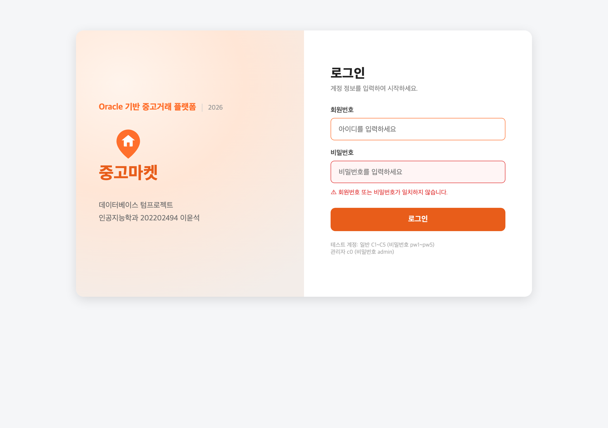

- **[사후 화면]** 로그인 성공 시 검색 홈으로 이동하고 상단 메뉴가 등장한다.

  

  반대로 일반 회원(`C1`)이 **관리자 전용 통계 페이지(`/admin/stats`)**에 직접 접근하면 권한 차단(403) 안내가 뜬다(라우트의 `@admin_required` 데코레이터). 관리자 `c0`로 로그인하면 상단에는 "통계·DB 내용" 메뉴만 노출된다.

  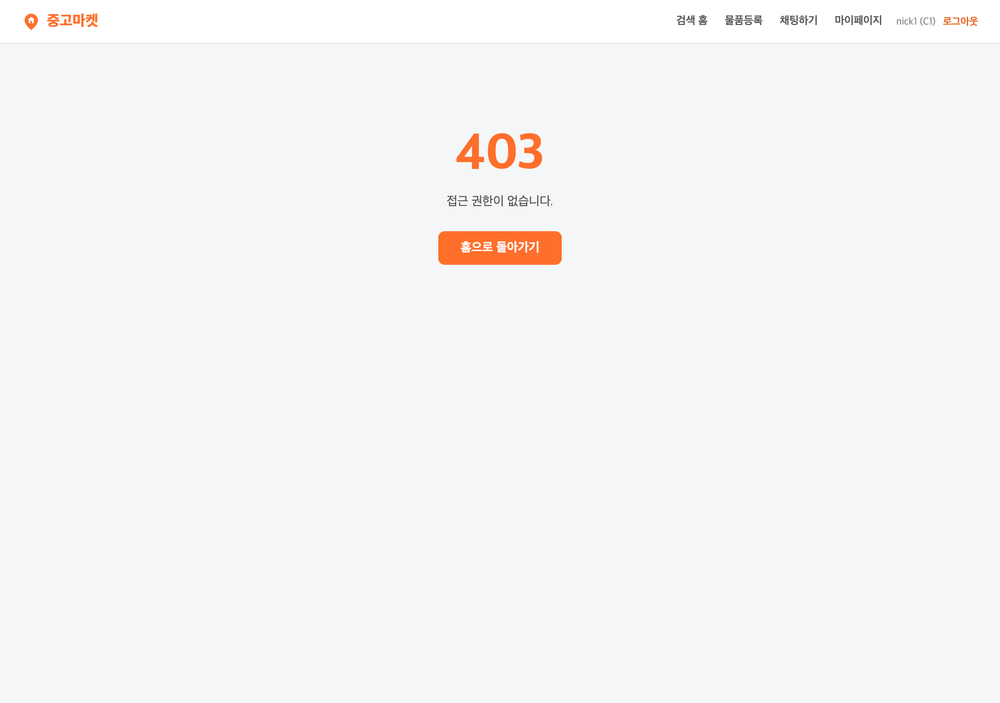

### 기능 2. 물품 등록 (`/items/new`)
- **[사전 화면]** 제목·카테고리·가격·거래장소·상세설명 + 사진 3장 슬롯이 있는 등록 폼. *(필수값을 비우고 등록하면 빨간 안내 문구 — 예외 처리.)*

  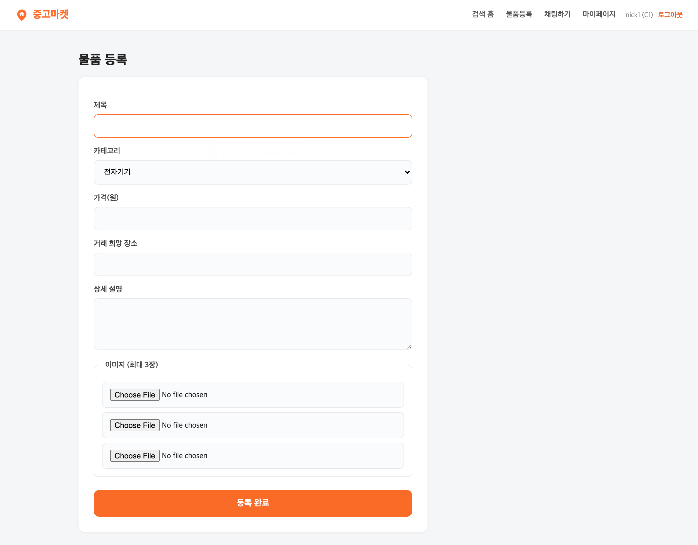 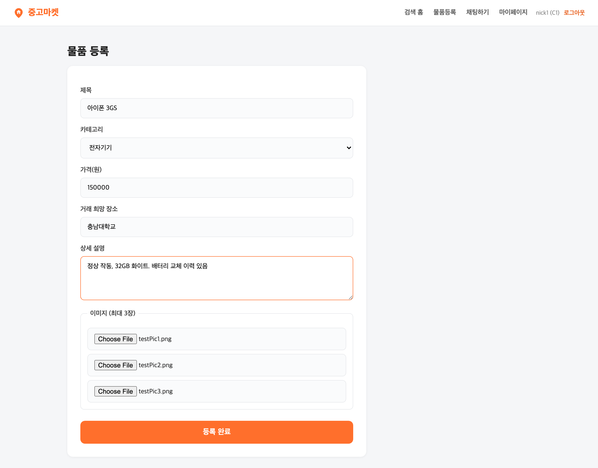

- **[조작]** 7개 항목 입력 + 사진 3장 업로드 후 [등록 완료]. *(예시: 제목 "아이폰 3GS", 거래 희망 장소 "충남대학교", 사진은 아이폰 3GS 3장.)*
- **[사후 화면]** 등록된 물품 상세 — 입력 항목 + 사진 3장이 그대로 표시된다(판매자별 itemNo 자동 부여). 이 물품이 이후 기능 3~7의 중심이 된다.

  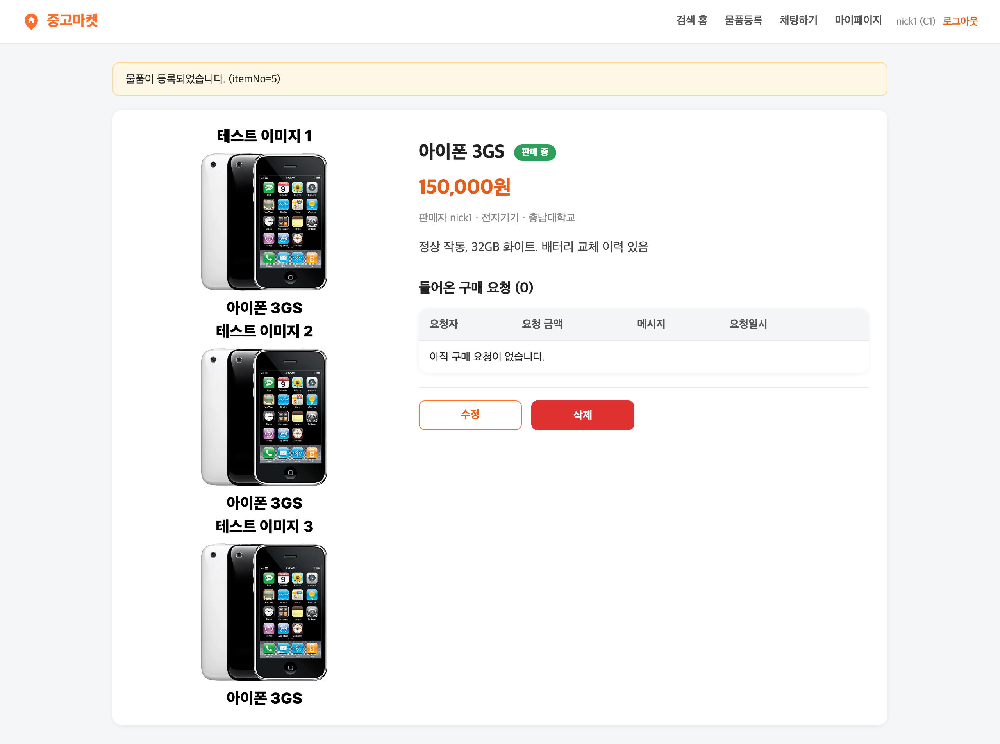

### 기능 3. 물품 검색 — AND/OR/NOT·정렬 (`/search`)
- **[조작·사후]** ① 단일 조건(제목="아이폰") 검색.

  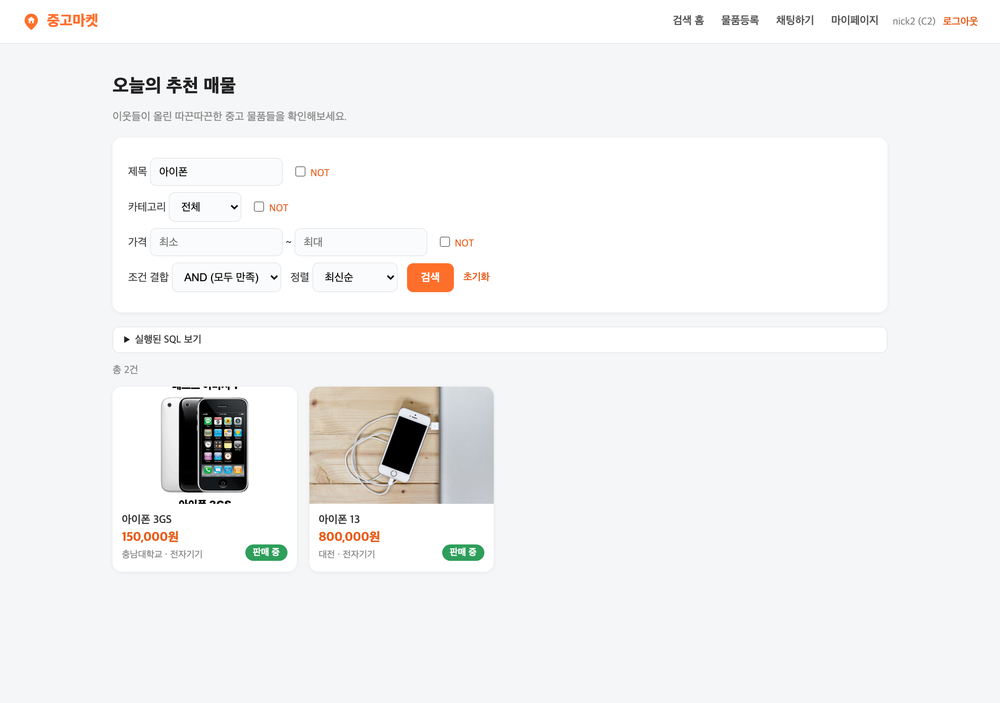

  ② 조합 조건(카테고리="전자기기" **AND** 가격 100000~900000) → 하단 **"실행된 SQL 보기"**를 펼치면 WHERE 절의 AND·BETWEEN이 그대로 보인다.

  

  ③ 정렬(가격 낮은순) 전환.

  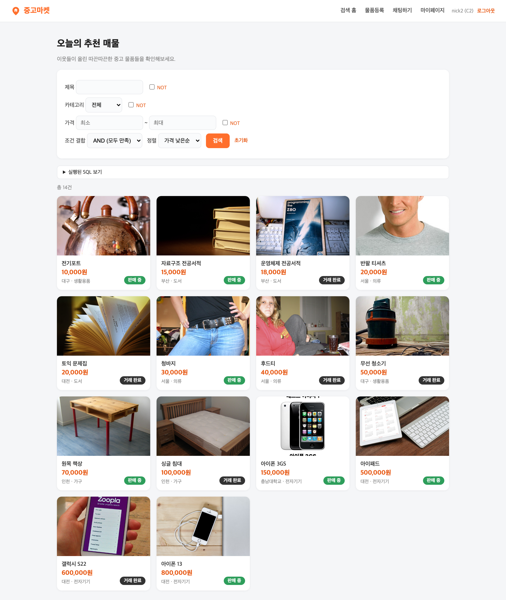

### 기능 4. 구매 요청 (여러 명) (`/items/<cno>/<itemNo>`)
- **[사전·조작]** 구매자가 물품 상세 하단의 [구매 요청 보내기]에 제시 금액·메시지를 입력해 요청한다.

  

- **[사후 화면]** 같은 물품에 여러 명이 요청하면, 판매자 A의 물품 상세(판매자 시점)에 **모든 요청이 목록**으로 보인다.

  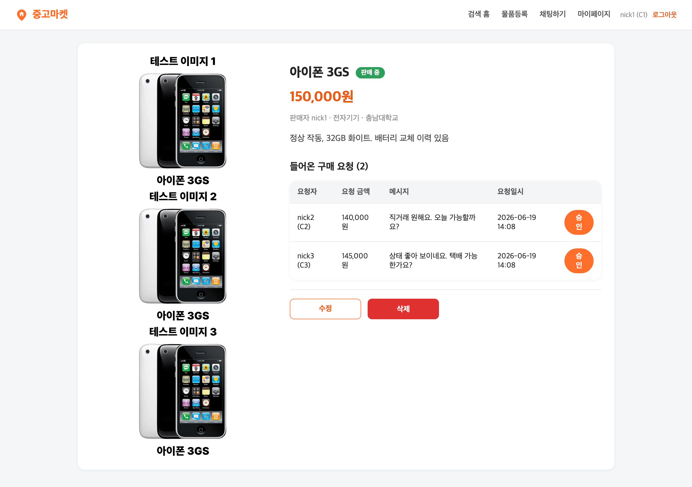

### 기능 5. 1:1 채팅 — 읽음 표시 (`/chats`, `/chats/<roomNo>`)
- **[사전 화면]** [채팅하기] 방 목록 — 방마다 **안 읽은 메시지 수 배지**가 표시된다.

  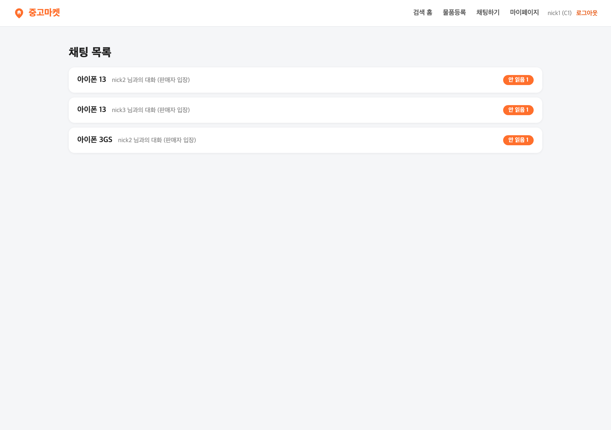

- **[조작·사후]** 방에 입장하면 보낸사람·시간·내용·**읽음 여부**가 표시되고, 입장 시 상대 메시지가 "안읽음→읽음"으로 바뀐다. 같은 물품에서 [1:1 채팅하기]를 다시 눌러도 새 방이 생기지 않고 기존 방으로 입장한다(중복 미생성).

  

### 기능 6. 거래 승인 → 예약 중 (`/items/<cno>/<itemNo>/approve`)
- **[사전 화면]** 판매 마이페이지에 B·C 등 요청이 보이는 상태.

  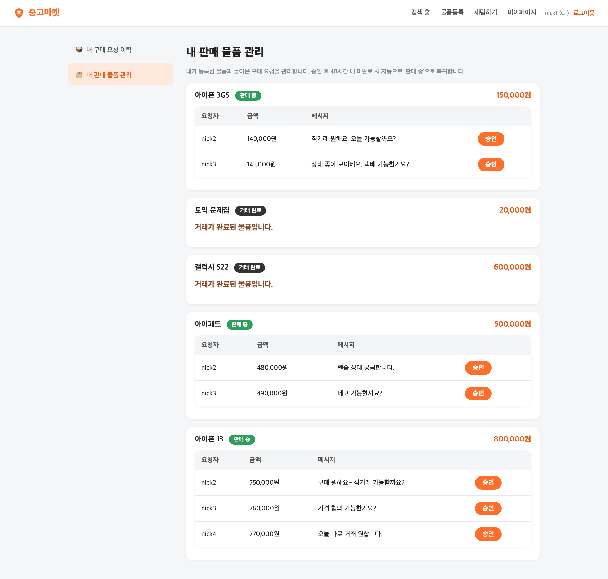

- **[조작]** A가 B의 요청 [승인].
- **[사후 화면]** 물품이 **'예약 중'**으로 전환되고, 승인되지 않은 다른 요청은 자동 삭제되며, B-A 채팅방이 활성화된다(승인 직후 채팅방으로 자동 이동).

  

### 기능 7. 거래 완료 (`/items/<cno>/<itemNo>/complete`)
- **[사전 화면]** '예약 중'으로 전환된 물품에만 **[거래 완료 처리]** 입력란이 나타난다(기능 6에서 이어지는 판매 마이페이지의 해당 물품, 또는 1:1 채팅방 우측 상단 — 모두 **판매자에게만** 노출). 판매 중·이미 완료된 물품에는 이 입력란이 보이지 않는다.
- **[조작]** **최종 거래 금액**을 숫자로 입력하고 [거래 완료 처리]를 누른다. 금액이 비어 있거나 숫자가 아니면 라우트(`complete_trade`)의 `finalPrice.isdigit()` 검증에 걸려 *"올바른 금액을 숫자로만 입력해 주세요."* 안내로 막힌다(예외 처리).
- **[사후 화면]** 서비스 계층의 `item_service.complete_trade`가 `UPDATE Item SET sellStatus='거래 완료', finalPrice=:fp WHERE … AND sellStatus='예약 중'`을 실행한다. WHERE 절의 `sellStatus='예약 중'` 조건 덕분에 **예약 중일 때만** 완료되며(이미 완료/판매 중 물품의 중복 완료를 DB 차원에서 차단), 갱신 행이 0이면 *"예약 중 상태의 물품만 완료할 수 있습니다."*로 안내한다. 성공 시 물품이 **'거래 완료'**(검정 배지)로 바뀌고 입력한 **최종 거래 금액(`finalPrice`)**이 저장되어, 물품 상세에 "최종 거래 금액: …원"으로 표시된다. 이렇게 쌓인 거래 완료 데이터가 곧 관리자 통계(기능 9)의 ROLLUP 집계 대상이 된다.

  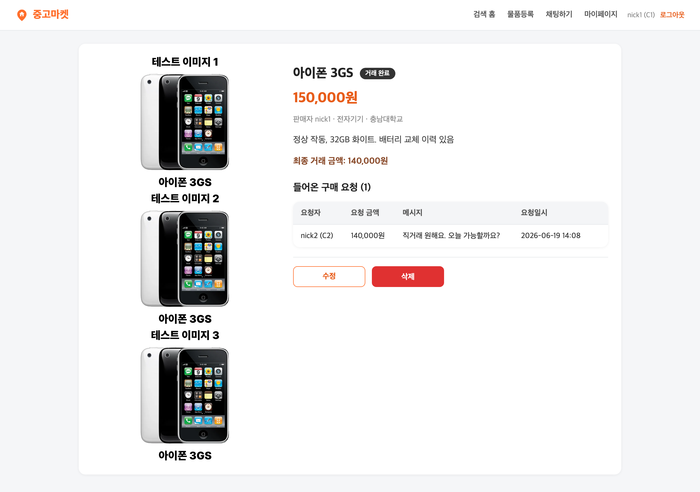

### 기능 8. 예약 자동 취소 — 48시간 초과 (`/items/<cno>/<itemNo>/force-expire`)
- **[사전 화면]** '예약 중' 물품 + 판매 마이페이지의 **[데모] 48시간 경과시키기** 버튼.

  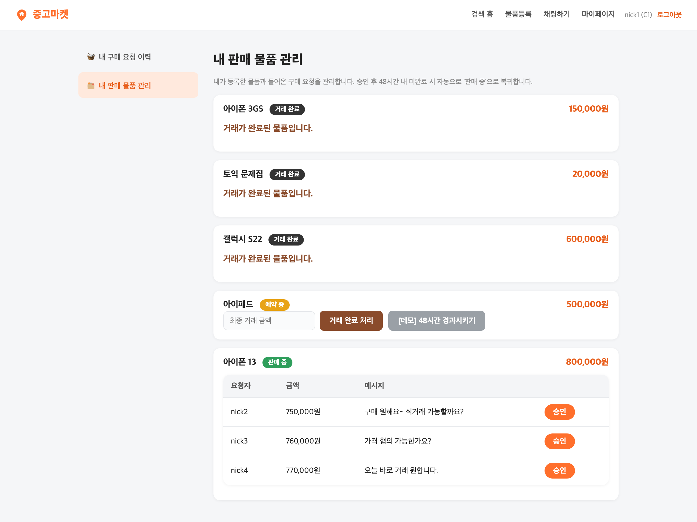

- **[조작]** 버튼 클릭(내부적으로 `resDateTime`을 49시간 전으로 돌리고 만료 처리).
- **[사후 화면]** 물품이 **'판매 중'**으로 복귀하고 해당 예약(구매 요청)이 삭제된다.

  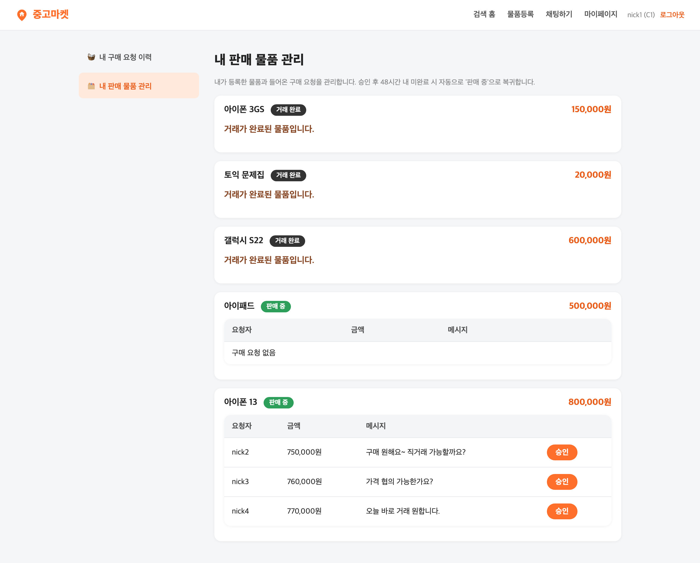

### 기능 9. 관리자 통계 (`/admin/stats`)
- **[사후 화면]** ① 그룹 함수(ROLLUP): 지역·카테고리별 거래 건수·총액 + 소계/총계 행. ② 윈도우 함수: 인기 판매자 순위(RANK)·물품별 요청수·판매자 누적 요청수.

  

### (추가) 예외 처리 — 없는 주소 접근
트레이스백 대신 안내 페이지(`error.html`)로 응답한다.

  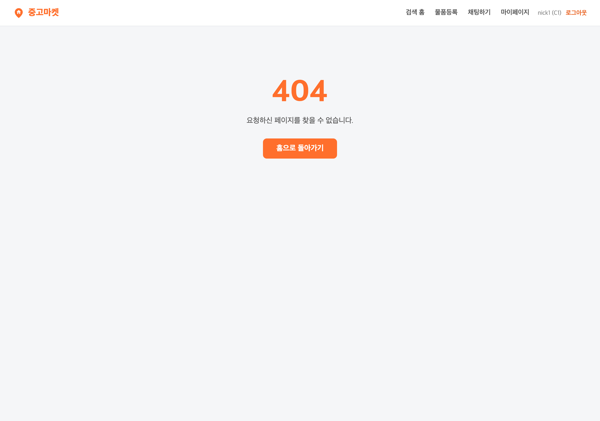

---

## 7-4. 소스 코드 설명 (50점)

### (1) 전체 디렉터리 구성

```
tp_demo/
├── app.py                      Flask 진입점 — 라우트·세션·서버측 검증·예외 핸들러
├── config.py                   DB 접속 정보(env override)·앱 상수(ADMIN, 48h)
├── db.py                       oracledb thin 커넥션 풀 + get_conn() 트랜잭션 컨텍스트
├── init_db.py                  schema/*.sql 적재 + static/seed 이미지 BLOB 주입
├── requirements.txt            런타임 의존성(Flask, oracledb)
├── docker-compose.yml          Oracle 23ai Free 컨테이너 정의
├── README.md                   프로젝트 소개(포트폴리오)
├── REPORT.md                   본 보고서
├── schema/
│   ├── 01_ddl.sql              테이블 5개 정의(TP-3) — PK/FK/UNIQUE/CHECK 제약
│   └── 02_seed.sql             시드 데이터(균형 축소판: 회원6·물품13·요청10·방2·메시지6)
├── services/                   엔티티별 도메인 로직(모든 SQL이 여기에)
│   ├── __init__.py
│   ├── customer_service.py       로그인·닉네임 조회
│   ├── item_service.py           등록·조건검색(AND/OR/NOT)·상세·수정/삭제·상태전이·48h 만료
│   ├── purchase_service.py       구매요청 생성/목록·승인 트랜잭션
│   ├── chat_service.py           채팅방 보장·메시지·안읽음 수·읽음 처리
│   ├── stats_service.py          관리자 통계 2종(ROLLUP, 윈도우 함수)
│   └── dump_service.py           전체 테이블 덤프(7-1)
├── templates/                  Jinja2 화면 (총 14개)
│   ├── base.html                 공통 레이아웃(상단바·플래시 메시지)
│   ├── _logo.html                로고 SVG 조각(include)
│   ├── login.html                로그인
│   ├── search_home.html          검색 홈(조건 검색·정렬·실행 SQL)
│   ├── item_register.html        물품 등록
│   ├── item_edit.html            물품 수정
│   ├── item_detail.html          물품 상세 + 구매요청/요청목록·승인
│   ├── mypage_seller.html        판매 마이페이지(요청 승인·완료·만료)
│   ├── mypage_buyer.html         구매 마이페이지(내 요청 이력)
│   ├── chat_list.html            채팅방 목록(안읽음 배지)
│   ├── chat_room.html            1:1 채팅방(읽음 표시·완료 처리)
│   ├── admin_stats.html          관리자 통계 대시보드
│   ├── db_dump.html              DB 테이블 내용(7-1)
│   └── error.html                403/404/500 안내 페이지
├── static/
│   ├── style.css                 스타일(상태 배지 색 등)
│   └── seed/                     시드 물품 사진(CC, init_db가 BLOB로 주입)
├── docs/                       보고서용 화면 캡처 PNG(eval/capture_screens.py 산출)
└── eval/
    ├── process.md                데모 시연 9단계 시나리오(평가표 대응)
    ├── capture_screens.py        Playwright 기반 화면 자동 캡처 도구
    └── testPic1~3.png            물품 등록 라이브 데모용 이미지
```

### (2) 파일별 상세 설명

코드는 **표현(`app.py`) → 도메인 서비스(`services/*`) → 데이터 접근(`db.py`) → Oracle** 의 3계층으로 흐른다. 각 파일의 책임과 주요 함수를 파일 단위로 설명한다. (각 SQL 알고리즘의 *동작 원리*는 7-2 (2)에 자세히 있으므로, 여기서는 **파일의 역할·구성·주요 함수**에 초점을 둔다.)

#### ⓐ 진입·설정·인프라

`app.py`는 사용자의 모든 요청을 받아 알맞은 화면으로 연결하는 표현 계층(진입점) 파일이다. `login_required`·`admin_required` 데코레이터를 사용하여 로그인하지 않은 요청이 들어오면 로그인 화면으로, 관리자가 아닌 요청이 관리자 전용 페이지로 들어오면 403 안내 화면이 출력되도록 하였으며, `current_cno()`로 세션의 회원번호를 읽고 `inject_user` 컨텍스트 프로세서로 모든 화면에 로그인 정보(`me`·`my_nick`·`is_admin`)가 전달되도록 했다. 각 라우트(로그인·검색·물품 등록/수정/삭제/상세·구매요청·승인·완료·48시간 만료·마이페이지·채팅·관리자 통계/덤프)는 폼 값을 먼저 검증(빈 값·`isdigit()` 등)하고 소유자·물품 상태를 확인한 뒤 서비스 함수를 호출하며, 그 결과를 `flash()` 안내 메시지와 함께 알맞은 화면으로 redirect하도록 하였다. 또한 `errorhandler`로 403/404/500 오류를 받으면 트레이스백 대신 `error.html` 안내 페이지가 출력되도록 하였다.

`config.py`는 애플리케이션의 설정값을 한곳에 모은 파일이다. 환경변수(`TP_DB_*`)를 우선 읽되 없으면 기본값을 쓰도록 하여 DB 접속 정보와 thin 모드 접속 문자열(`DSN`)을 구성하였으며, 관리자 회원번호(`ADMIN_CNO='c0'`)·예약 만료 기준 시간(`RESERVE_TIMEOUT_HOURS=48`)·세션 비밀키 같은 상수를 정의하여 코드 곳곳에 흩어질 매직값을 제거했다.

`db.py`는 Oracle과의 연결을 관리하는 데이터 접근 계층 파일이다. 모듈이 처음 로드될 때 커넥션 풀을 한 번만 생성(`min=1`, `max=8`)하고, `get_conn()` 함수를 사용하여 풀에서 커넥션을 빌려주되 작업이 정상적으로 끝나면 `commit`, 도중에 예외가 발생하면 `rollback`한 뒤 항상 커넥션을 반납하도록 하였다. 이렇게 하여 모든 서비스가 이 함수만 사용하면 트랜잭션 경계가 자동으로 보장되도록 했다. 또한 `query_all()` 함수에 SELECT 문을 넘기면 `(컬럼 목록, 행 목록)` 형태로 결과가 출력되도록 하여 통계·덤프 기능에서 재사용했다.

`init_db.py`는 데이터베이스를 초기 상태로 구축하는 스크립트이다. `split_statements()` 함수가 SQL 파일을 받으면 주석을 제거하고 세미콜론을 기준으로 문장을 나누도록 하였고, `run_file()`이 각 문장을 차례로 실행하되 최초 실행 때 삭제할 테이블이 없어 발생하는 `ORA-00942` 오류는 무시하도록 했다. `load_images()` 함수는 `SEED_IMAGES` 매핑을 사용하여 `static/seed/` 폴더의 사진 파일을 읽어 `Item` 테이블의 `pic1~3`(BLOB) 컬럼에 주입하며, `main()`은 DDL → 시드 → 이미지 순으로 적재한 뒤 테이블별 행 수가 출력되도록 하였다.

#### ⓑ 도메인 서비스 계층 (`services/`)
서비스 계층의 각 파일은 한 엔티티(또는 한 관심사)의 SQL과 트랜잭션을 담당하며, 모든 사용자 입력을 바인드 변수로만 전달하여 SQL 인젝션을 차단하도록 하였다.

`customer_service.py`는 회원 인증을 담당하는 파일이다. `login()` 함수에 회원번호와 비밀번호를 넘기면 바인드 변수로 조회하여 일치하는 회원 정보를, 없으면 `None`이 출력되도록 하였고, `get_nickname()`에 회원번호를 넘기면 해당 닉네임이 출력되도록 했다.

`item_service.py`는 물품과 관련된 모든 기능을 담당하는 가장 큰 파일이다. `search()` 함수에 검색 조건과 결합 연산자(AND/OR)·정렬 기준을 넘기면 조건을 동적으로 조립하여 결과 목록과 실제 실행된 SQL 문자열이 함께 출력되도록 하였고, `get_item()`·`get_image()`로 물품 한 건의 상세 정보와 사진(BLOB)을 받아오도록 했다. `register_item()`은 `MAX(itemNo)+1`로 판매자별 물품번호를 자동 채번하여 새 물품을 등록하고, `delete_item()`은 외래키 제약 때문에 `Message → ChatRoom → PurchaseReq → Item` 순으로 자식부터 삭제하도록 하였다. 또한 `complete_trade()`는 예약 중인 물품을 최종 금액과 함께 거래 완료로 바꾸며, `expire_reservations()`는 화면을 열 때마다 호출되어 예약된 지 48시간이 지난 물품을 자동으로 판매 중으로 되돌리도록 했다.

`purchase_service.py`는 구매 요청을 담당하는 파일이다. `create_request()`로 구매자가 제시 금액·메시지를 넘기면 요청이 저장되며(같은 사람이 같은 물품에 중복 요청하면 복합 기본키 제약에 걸려 막힌다), `requests_for_item()`·`my_requests()`로 물품에 들어온 요청 목록이나 내가 보낸 요청 목록이 출력되도록 했다. 핵심인 `approve_request()`는 판매자가 한 요청을 승인하면 ① 물품을 예약 중으로 바꾸고 ② 승인되지 않은 다른 요청을 모두 삭제하며 ③ 구매자–판매자 채팅방을 활성화하는 세 단계를 하나의 트랜잭션으로 처리하도록 하였다.

`chat_service.py`는 1:1 채팅을 담당하는 파일이다. `ensure_room()`(내부적으로 `_ensure_room_cur()`) 함수에 구매자·판매자·물품 조합을 넘기면 UNIQUE 제약과 `RETURNING`을 이용하여 이미 방이 있으면 그 방을, 없으면 새 방을 만들어 방 번호가 출력되도록 하여 물품당 방이 하나만 생기게 했다. `list_rooms()`는 내가 참여한 방 목록과 함께 상대가 보낸 안 읽은 메시지 수가 출력되도록 하였고, `get_room()`은 방 번호와 내 회원번호를 받아 당사자인지 확인하고 내 역할(판매자/구매자)을 판정하며, `send_message()`·`mark_read()`로 메시지를 보내거나 방에 입장할 때 상대 메시지를 읽음 처리하도록 했다.

`stats_service.py`는 관리자 통계를 담당하는 파일이다. ROLLUP을 사용하는 그룹 함수 질의(`GROUP_FUNCTION_SQL`)와 RANK·누적합을 사용하는 윈도우 함수 질의(`WINDOW_FUNCTION_SQL`)를 상수로 정의해 두고, `group_function_stat()`·`window_function_stat()` 함수를 호출하면 각각 지역·카테고리별 거래 집계(소계·총계 포함)와 판매자 인기 순위·물품별 누적 요청 수가 `(컬럼, 행)` 형태로 출력되도록 했다.

`dump_service.py`는 7-1의 'DB 내용' 화면을 위한 파일이다. `dump_all()` 함수가 5개 테이블을 차례로 `SELECT *` 하여 전체 행을 모으되, 사진 컬럼(`pic1~3`)은 화면이 무거워지지 않도록 `<BLOB n바이트>`처럼 길이만 표시되도록 하였다.

#### ⓒ 스키마 (`schema/`)
`01_ddl.sql`은 5개 테이블의 구조를 정의한 DDL 파일이다. 자식 테이블부터 부모 순으로 삭제한 뒤 다시 생성하며, 기본키(복합키 `Item(cno,itemNo)` 포함)·외래키(`Item→Customer`, `PurchaseReq/ChatRoom→Item` 등)·UNIQUE(닉네임, `ChatRoom(receiveCno,cno,itemNo)`)·CHECK(판매상태·발신자·읽음여부)·IDENTITY(방번호·메시지순번) 제약을 함께 선언하였다. `02_seed.sql`은 데모와 통계에 쓸 초기 데이터(회원·물품·요청·채팅·메시지)를 넣는 파일이며, 사진(BLOB)은 SQL로 넣을 수 없어 `init_db.py`가 따로 주입하도록 했다.

#### ⓓ 화면(`templates/`, 14개) · 정적 자원(`static/`)
`templates/` 폴더는 화면(HTML)들을 모은 곳으로, 모든 화면이 공통 레이아웃 `base.html`을 상속(``)하고 `_logo.html` 같은 조각을 포함(``)하여 중복을 줄이도록 했다. 로그인·검색·등록/수정·상세·마이페이지(판매/구매)·채팅(목록/방)·통계·덤프·오류 화면 등 14개로 이루어진다. `static/style.css`는 카드·표·상태 배지(판매중 초록·예약중 노랑·완료 검정) 같은 화면 스타일을 담았고, `static/seed/` 폴더에는 시드 물품 사진이 들어 있다.

#### ⓔ 개발 도구 (`eval/`)
`eval/` 폴더는 평가·시연을 돕는 도구를 모은 곳이다. `process.md`는 데모 9단계 시나리오를, `capture_screens.py`는 Playwright로 앱을 자동 조작하여 보고서용 화면을 캡처하는 스크립트를, `testPic1~3.png`는 물품 등록 라이브 시연용 아이폰 3GS 사진을 담고 있으며, 모두 실행에 필요한 런타임 의존성은 아니다.

### (3) 요청 처리 흐름 예시 — "구매 요청 승인"
계층이 어떻게 맞물리는지 한 동작으로 따라가 본다.
1. 판매자가 판매 마이페이지에서 **[승인]** 클릭 → 브라우저가 `POST /items/C1/5/approve` (숨김 필드 `buyer=C2`).
2. `app.approve_request` 라우트: `@login_required`로 세션 확인 → **소유자 검증**(`cno != current_cno()`면 `abort(403)`) → `purchase_service.approve_request("C1", 5, "C2")` 호출.
3. `purchase_service.approve_request`: `db.get_conn()` 트랜잭션 안에서 ① `Item`을 '예약 중'으로 UPDATE(`rowcount != 1`이면 `ValueError`), ② 승인되지 않은 다른 요청 DELETE, ③ `chat_service._ensure_room_cur`로 채팅방 보장 → `roomNo` 반환.
4. with 블록이 예외 없이 끝나면 `get_conn`이 **자동 `commit`** (중간 예외 시 전체 `rollback`).
5. 라우트가 `flash(...)` 후 채팅방으로 redirect → `chat_room.html` 렌더.

이처럼 **라우트(검증·흐름) → 서비스(SQL·트랜잭션) → db(커밋/롤백)** 로 책임이 분리돼, 화면을 바꿔도 SQL은 그대로, SQL을 바꿔도 화면 흐름은 그대로 유지된다.

### (4) 가독성·주석 방침
모든 모듈·함수에 한국어 docstring을 달아 의도와 트랜잭션 경계를 설명했고, 복잡한 SQL(검색 조립, ROLLUP/윈도우)에는 줄 단위 주석을 두었다. 함수는 한 가지 책임만 갖도록 작게 나눴다(예: 채팅방 보장 로직은 `_ensure_room_cur`로 분리해 일반 호출과 트랜잭션 내부 호출이 공유). 명명은 `동사+명사`(예: `register_item`, `expire_reservations`)로 통일했다.

> **[첨부] 소스코드**: 위 `tp_demo/` 전체를 zip에 포함한다. 핵심 파일(`app.py`, `services/*.py`, `schema/*.sql`)을 보고서 본문 부록에 그대로 붙여 넣어도 좋다.

---

## 부록. 제출 절차 체크리스트

1. **소스 정리** — 압축 전 다음을 제외한다: `.venv/`, `__pycache__/`(루트·services), `.DS_Store`. (의존성은 `requirements.txt`로 재현되므로 가상환경은 넣지 않는다.) `static/seed/`·`docs/`·`eval/`는 포함한다.
2. **보고서 완성** — 본 `REPORT.md` 내용을 학번/이름을 적은 한글(hwp)/워드 양식에 옮기고, 7-3·7-1의 `docs/*.png` 이미지를 그대로 끼운다. 화면을 다시 캡처하려면 `docker start tp_oracle && python init_db.py` 후 앱을 `TP_DEBUG=0`으로 띄우고 `python eval/capture_screens.py`를 실행한다.
3. **압축** — 완성된 보고서 파일 + `tp_demo/` 소스를 함께 `학번_TP-7.zip`으로 묶는다. (예: `202202494_TP-7.zip`)
4. **제출** — **2026-06-20 23:59**(1차) 전에 과제 제출 메뉴에 업로드. 6/21 제출 시 21점 감점(189점 만점).
5. **데모 대비** — 6/22~23 ZOOM 데모는 `eval/process.md`의 9단계 시나리오대로 시연한다. 캡처 스크립트가 시드 상태를 변형하므로, 데모 직전 `python init_db.py`로 깨끗한 상태로 재초기화한다.
